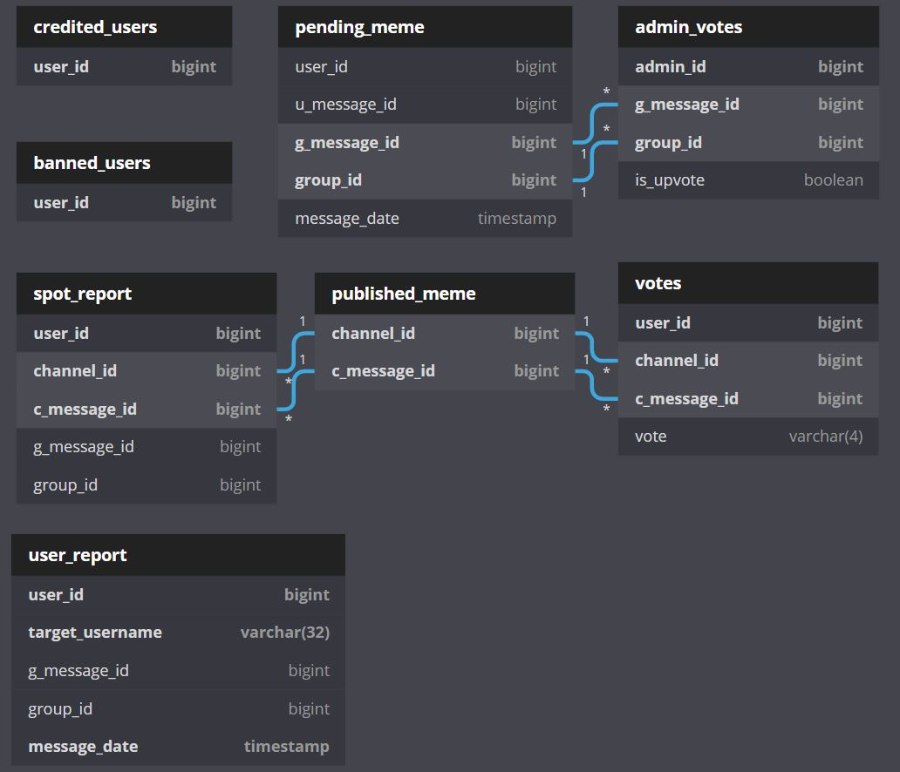

Database schema
===========================================
This is the schema of the database used to store informations about the spots and their reactions

This image has been created with the following script on `dbdiagram.io <https://dbdiagram.io/home>`_::

   Table pending_meme as PE {
   user_id bigint [not null]
   u_message_id bigint [not null]
   g_message_id bigint [pk]
   group_id bigint [pk]
   message_date timestamp
   }

   Table published_meme as PU {
   channel_id bigint [pk]
   c_message_id bigint [pk]
   }
   

   Table votes {
   user_id bigint [pk]
   channel_id bigint [pk, ref: > PU.channel_id]
   c_message_id bigint [pk, ref: > PU.c_message_id]
   vote varchar(4) [not null]
   }

   Table admin_votes {
   admin_id bigint [pk]
   g_message_id bigint [pk, ref: > PE.g_message_id]
   group_id bigint [pk, ref: > PE.group_id]
   is_upvote boolean [not null]
   }

   Table credited_users {
   user_id bigint [pk]
   }

   Table banned_users {
   user_id bigint [pk]
   }

   Table spot_report {
   user_id bigint [pk]
   channel_id bigint [pk, ref: > PU.channel_id]
   c_message_id bigint [pk, ref: > PU.c_message_id]
   g_message_id bigint [not null]
   group_id bigint [not null]
   }

   Table user_report {
   user_id bigint [pk]
   target_username varchar(32) [pk]
   g_message_id bigint [not null]
   group_id bigint [not null]
   message_date timestamp [pk]
   }